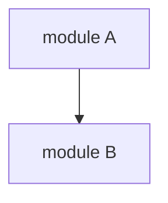
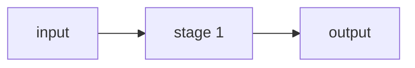

# Design

Produce structural + behavioral + decision design documents for a feature, then gate with architecture review.

## Phase 0: Parse arguments

- `$ARGUMENTS[0]` — feature slug (required)
- `$ARGUMENTS[1+]` — optional design-note context

If slug is missing, ask.

## Phase 1: Read upstream artifacts

Read in this order (required ones marked):

1. **`docs/{feature}/map.md`** — REQUIRED. If missing, stop and ask user to run `/map`.
2. `docs/{feature}/synthesis.md` — preferred if present
3. `docs/{feature}/review/*.md` — all reviewer files (if synthesis absent)
4. `docs/{feature}/audit.md` — if present (treat as elevated-priority synthesis)
5. `docs/{feature}/scope.md` — if present
6. `docs/_meta/design.md` — if present, READ. Inter-feature ADRs (MADRs) are INHERITED by this design; feature-local ADRs must honour them or explicitly flag conflicts.
7. `docs/_meta/map.md` — if present, read for shared touch-point context.

**Do NOT re-grep the codebase.** Every reference to existing code must come from `map.md`.

**Scribe-on-latest read rule.** For every upstream artifact read above, also read any `## User resolutions`, `## Binding chat decisions`, or `## Post-READY amendments` section present. Treat those sections as equal-priority to reviewer consensus and cite them explicitly when they shape a decision.

**Large upstream artifacts.** When a file is >400 lines, use `Read(offset, limit)` on specific sections you care about. Do NOT chunk-read via `Bash(sed|head|tail)` — Bash chunking fragments formatting, wastes tokens, and breaks the markdown flow the reader expects.

### Meta-conflict check

If `docs/_meta/design.md` exists and any MADR's "Consequences per feature" line for this slug conflicts with a decision this feature must make, **STOP** and push back to the user:

```
docs/_meta/design.md § MADR-N requires this feature to {X}.
This design needs to assert {Y}, which contradicts the MADR.

Choose:
  1. Re-run /meta-design to resolve at portfolio level
  2. Override locally — I'll add a "Meta overrides" section in 03-decisions.md documenting the deviation
  3. Cancel this /design invocation
```

WAIT for the user. Do NOT silently override.

## Phase 2: Determine which design docs are needed

Core files (always):
- `design/README.md` — index + acceptance criteria
- `design/01-architecture.md` — structural view
- `design/02-behavior.md` — behavioral view
- `design/03-decisions.md` — decision view (ADRs, trade-offs)

Conditional files (create only if applicable):
- `design/04-data-flow.md` — if the feature has a data pipeline with >2 stages
- `design/05-api-contract.md` — if the feature exposes endpoints

Ask yourself: does this feature have a data pipeline? An API? If yes, plan the conditional file.

## Phase 2.5: Frontmatter convention (apply to every design doc)

Every file under `docs/{feature}/design/` starts with this YAML frontmatter:

```yaml
---
feature: {slug}
view: {structural|behavioral|decision|data-flow|api-contract}
status: DRAFT
date: YYYY-MM-DD
---
```

Pinned rules (do not drift):

- `view:` values are exactly these five strings. US spelling — `behavioral` not `behavioural`. File → view mapping:
  - `README.md` → omit `view:` (it's the index, not a view)
  - `01-architecture.md` → `structural`
  - `02-behavior.md` → `behavioral`
  - `03-decisions.md` → `decision`
  - `04-data-flow.md` → `data-flow`
  - `05-api-contract.md` → `api-contract`
- `status:` lives ONLY in frontmatter. Do NOT also write `**Status**: DRAFT` in the body — duplication means the two places can diverge.
- `feature:` matches the slug used in the command invocation exactly.
- `date:` is today's date in ISO form (`YYYY-MM-DD`).

README.md gets `feature`, `status`, `date` only (no `view`).

## Phase 3a: Draft README only (scope-approval gate)

Output: `docs/{feature}/design/README.md`.

Contents:

```markdown
---
feature: {slug}
status: DRAFT
date: YYYY-MM-DD
---

# {Feature Name}

## Business Context
Problem + who benefits.

## Acceptance Criteria
- [ ] ...

## Scope
- In scope: ...
- Out of scope: ...

## Module sketch (scope-level, non-binding)

One Mermaid block. One node per module or surface being added or modified;
edges showing "calls" / "produces" / "consumes". Coarse — actor-level, not
function-level. ~5–10 lines. Purpose: let the user see the *shape* of the
addition before ADRs are written. Architect does NOT verify this against
`01-architecture.md`; the detailed module diagram in Phase 3b is the
source of truth.



## Data-flow sketch (scope-level, non-binding)

One Mermaid block. One arrow per pipeline stage, from raw input to rendered
output. ~5–10 lines. Purpose: let the user see *how many hops* the design
introduces.



## Planned conditional documents
Will this feature need `04-data-flow.md`? `05-api-contract.md`? State yes/no with one-sentence reason.

## Approach summary
One sentence per major ADR you intend to write — just the headline choice, not the rationale. This lets the user catch a wrong-direction call before 1500 lines of ADRs get drafted.

## Documents (to be drafted in Phase 3b)
| File | View | Description |
```

**GATE 1** — present the README to the user:

```
Scope and approach drafted at docs/{feature}/design/README.md.

Planned ADR headlines:
  1. {headline}
  2. {headline}
  ...

Conditional docs: {04-data-flow.md: yes/no} {05-api-contract.md: yes/no}

Please review and:
  1. Approve scope — I'll draft the remaining design docs (Phase 3b)
  2. Request scope changes — I'll revise the README only
  3. Questions
```

**WAIT** for approval of scope. If user approves, proceed to Phase 3b. If user requests scope changes, revise README and re-present — do not draft 01/02/03 until scope is green.

## Phase 3b: Draft remaining design documents

Output: `docs/{feature}/design/01-architecture.md`, `02-behavior.md`, `03-decisions.md`, and any approved conditional files.

### 01-architecture.md (structural view)
- System context (actors, external systems)
- Module structure (components + dependencies) with Mermaid diagram
- Module descriptions (responsibility, inputs, outputs, dependencies)
- Boundaries + minimal surface area
- **`## Delta view — what changes`** (REQUIRED). One annotated Mermaid diagram
  showing current-vs-proposed as a single figure — NOT two side-by-side
  diagrams. Use `classDef` for node fills and inline `style` for edges:

  ```markdown
  ## Delta view — what changes

  ```mermaid
  graph TD
    %% nodes and edges
    classDef new fill:#9f6,stroke:#333;
    classDef removed fill:#f99,stroke:#333,stroke-dasharray:5 5;
    classDef touched fill:#ff9,stroke:#333;
    class NEW_NODE new;
    class MOD_NODE touched;
    class OLD_NODE removed;
    linkStyle 0 stroke:#3a3,stroke-width:2px;             %% new edge
    linkStyle 1 stroke:#a33,stroke-dasharray:5 5;         %% removed edge
  ```

  ### Legend
  - Green fill / solid green edge: added by this feature
  - Yellow fill: existing module, modified by this feature
  - Red dashed fill / red dashed edge: removed by this feature
  - Unstyled: existing, unchanged
  ```

  Draw material from `map.md § Blast radius` (what exists today) and the
  module-structure section above (proposed). Reviewers count green
  nodes/edges to detect over-scoping. If nothing is added, modified, or
  removed, this feature does not need `/design`.

### 02-behavior.md (behavioral view)
- Data flow overview (Mermaid flowchart)
- Use cases — happy path sequence diagram + error paths
- State transitions if applicable

### 03-decisions.md (decision view)

This file has **two distinct numbered lists** — do not mix them:

- **ADRs (`ADR-001`, `ADR-002`, …)** — decisions that are made. Each ADR:
  - Status: `ACCEPTED` (or `SUPERSEDED` / `REJECTED` for older entries)
  - Context, Options considered, Decision (explicit), Trade-offs (Gains / Costs), Risks
  - An ADR whose Decision is not yet made is NOT an ADR — promote it to an Open Question instead.
- **Open Questions (`OQ-1`, `OQ-2`, …)** — items that cannot be decided without human/domain input. Each OQ:
  - Context — what the question is
  - Options — candidate answers
  - What blocks a decision — what information or authority is missing
  - Who should decide

Plus (always):

- **Hard constraints** — non-negotiable limits the design respects
- **Deliberate departures from synthesis / audit** — REQUIRED if `synthesis.md` or `audit.md` exists upstream. List every upstream recommendation the design did NOT adopt, each with one-sentence reason. Skipping this section when upstream synthesis/audit exists is a defect — architect will flag it.
- **`## Binding chat decisions`** — always-present, initially-empty section. The main agent appends binding verbal decisions made during a `/design` iteration here (scribe-on-latest target when `03-decisions.md` exists and `design/` is not yet READY). Each entry: one bullet with date + one-line summary + pointer to the ADR it supersedes or the OQ it closes.
- **`## Post-READY amendments`** — always-present, initially-empty section. When the user makes a binding decision *after* the architect has emitted `READY` and before `/plan`, the main agent appends here AND re-dispatches the architect gate (because the READY verdict applies to the pre-amendment bundle). Each entry: date + decision + rationale + "architect re-gated on {date}".

After drafting `03-decisions.md`, append time-boxed deferrals to `docs/_meta/deferred.md`:

For every item in the "Deliberate departures from synthesis/audit" section that is **time-boxed** (deferred to a future round) rather than a permanent rejection, append a row to `docs/_meta/deferred.md`. If the file does not exist, create `docs/_meta/` and write the header + first row. Schema (always the full row; never overwrite existing rows):

| Field | Value |
|-------|-------|
| ID | auto-increment from max existing (`D-001` if file is empty / new) |
| Source feature | this slug — OR the literal string `_meta` when `/meta-design` Phase 6.5 appends a portfolio-level deferral |
| Source doc | `design/03-decisions.md § Deliberate departures` (per-feature) — OR `_meta/design.md § <section>` (meta) |
| Description | one-line |
| Reason deferred | one-line |
| Cost | `S` / `M` / `L` heuristic |
| Depends on | explicit dependency or `—` |
| Status | `DEFERRED` |

**Permanent rejections** stay in `03-decisions.md § Deliberate departures` and do NOT go to `_meta/deferred.md` — they're not roadmap items. The user can re-classify any item.

If `docs/_meta/deferred.md` does not yet exist, create it with this header before adding the first row:

```markdown
---
date: YYYY-MM-DD
schema_version: 1
---

# Deferred — portfolio roadmap

Append-only table of items deferred across all features. Each row carries provenance so the architect can re-prioritise without re-reading the source feature's design archive. Status values: `DEFERRED | IN-CONSIDERATION | REJECTED | ACTIVATED`.

| ID | Source feature | Source doc | Description | Reason deferred | Cost | Depends on | Status |
|----|----------------|------------|-------------|-----------------|------|------------|--------|
```

Every `file:line` reference in any design doc must come from `map.md`. If the doc needs to reference something not in the map, flag it as an Open Question and trigger re-mapping rather than inventing references.

## Phase 4: Present full bundle for approval

Gate-framing rule: **every Open Question is presented with a proposed default + one-line rationale.** The user reads the defaults and flags only the ones they want to override. This replaces "answer 4 questions cold" with "audit 4 defaults." The cognitive work moves from generation ("what should k be?") to discrimination ("does single-median look right? yes/no").

Why this shape: many OQs are architecture-level calls the assistant can reasonably default on (with a review-later flag); only a subset require domain judgment the user genuinely owns. Forcing the user to generate an answer for the first kind produces under-informed decisions that are worse than a surfaced default. When the user *does* have conviction, flagging an override is ergonomic — one sentence, not four.

```
Design documents drafted at docs/{feature}/design/:
  - README.md (scope approved in Phase 3a)
  - 01-architecture.md
  - 02-behavior.md
  - 03-decisions.md — {N} ADRs, {M} Open Questions
  [+ conditional files]

Key design choices made (ADRs):
  1. {ADR-NNN headline} — one-line rationale
  2. {ADR-NNN headline} — one-line rationale
  ...

Open Questions — proposed defaults (approve silently, flag exceptions only):
  OQ-1: {title}
        Default: {proposed answer}
        Why:     {one-line rationale — what makes this the safest/cheapest/lowest-coupling option}
        Domain?  {YES if this genuinely needs user's subject-matter call;
                  NO if this is an architecture default the assistant is confident in}

  OQ-2: {title}
        Default: {proposed answer}
        Why:     {one-line rationale}
        Domain?  ...

  ...

Deliberate departures from upstream {synthesis|audit|review} — {count}:
  {list first few with one-line each}

Please review and respond in one of these shapes:

  "approve all"                        — accept all proposed OQ defaults; I'll promote each to an ADR
                                         and dispatch architect gate
  "approve, override OQ-2 and OQ-4"    — accept the others; tell me the override for each named OQ;
                                         I'll apply the overrides, promote the remaining defaults,
                                         and dispatch architect
  "request changes: {what}"            — design-level changes (not OQ-answer-level); I'll revise
                                         and re-present
  "questions"                          — ask about specific sections before deciding
```

**OQ classification in the prompt**: the `Domain?` field is load-bearing. When `Domain? YES`, tell the user this is *their* call — the default is a tentative placeholder the assistant picked to avoid blocking, and the user should flag an override if they have conviction. When `Domain? NO`, the default is the assistant's architecture recommendation and "approve all" is genuinely the right default.

**Self-audit before presenting**: before emitting the Phase 4 prompt, walk the Open Questions and classify each. If >50% are `Domain? YES` the design is asking too much of the user — revise the docs to pull the assistant's own position into ADRs (with TODO markers for "validate with domain expert at implement time") and re-present. The goal is that most OQs carry `Domain? NO` and are closed by "approve all."

**WAIT** for user approval. On approval:
1. For every OQ the user approved (explicitly or by silence on the "approve all" path), promote it to an ADR (next ADR-NNN) in `03-decisions.md`. The Decision line is the proposed default. The Status line notes "ACCEPTED — promoted from OQ-{N} at Gate 2, {date}".
2. For every override the user flagged, apply the override as the new Decision, promote to ADR, and cite "Overrode default at Gate 2, reason: {user's override}".
3. Update every `design/*.md` frontmatter: set `status: APPROVED`.

## Phase 5: Architecture review gate

Dispatch `architect` agent via Agent tool with `subagent_type: "architect"`:
```
Review docs/{feature}/design/*.md against docs/{feature}/map.md.

Check internal consistency, completeness, pattern alignment with map.md, and design principles.

Also read `## User resolutions`, `## Binding chat decisions`, and `## Post-READY amendments` sections in every upstream artifact (map.md, synthesis.md, review/*.md, design/03-decisions.md). Treat them as equal-priority to ADRs; flag any design doc that silently contradicts a scribed decision.

Write docs/{feature}/design/review.md with Verdict: READY FOR IMPLEMENTATION | NEEDS ITERATION | NEEDS DISCUSSION.
```

## Phase 6: Handle verdict

Read `docs/{feature}/design/review.md` and parse the Verdict line.

**READY FOR IMPLEMENTATION:**
```
✅ Design approved and review passed.
Design: docs/{feature}/design/
Review: docs/{feature}/design/review.md

Next: /plan {feature}
```

**NEEDS ITERATION:**
1. Surface architect's issues to user
2. Ask which to address
3. Update design docs
4. Re-dispatch architect (loop Phase 5)
5. Repeat until READY

**NEEDS DISCUSSION:**
1. Surface architect's open questions
2. Wait for user input
3. Update design docs
4. Re-dispatch architect

## Rules

1. **Design reads from map.md, not from code.** No re-grep. Large upstream artifacts use `Read(offset, limit)`, not `Bash(sed)`.
2. **Multi-file by view.** Never put everything in one doc.
3. **Frontmatter is pinned.** `feature`, `view` (from the fixed vocabulary), `status`, `date`. `status` never duplicated in body.
4. **ADRs and Open Questions are distinct.** An ADR has a decision made. An OQ does not. Do not mix the two numbering schemes.
5. **"Deliberate departures" is required** in `03-decisions.md` when synthesis or audit exists upstream.
6. **Every choice has a rationale in 03-decisions.md.** No decisions made silently in architecture or behavior docs.
7. **Mermaid for diagrams.** Renderable, versionable, diffable.
8. **Two human gates before architect.** Phase 3a (scope approval) then Phase 4 (full bundle approval). Both required.
9. **Architect gate before `/plan`.** Do not recommend `/plan` until architect verdict is READY.
