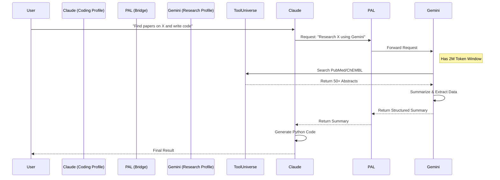

# System Architecture

## Overview

SciAgent-toolkit is a modular infrastructure that orchestrates interactions between AI Agents (Claude, Gemini, Codex) and specialized Scientific Tools via the Model Context Protocol (MCP).

## Core Components

### 1. AI Agents (The "Frontend")
- **Claude Code**: Primary interactive CLI for coding and complex reasoning.
- **Gemini CLI**: High-context agent for deep research and heavy data processing.
- **Codex CLI**: Specialized terminal interface for scientific tasks.

### 2. Profile Manager (The "Controller")
- **Script**: `switch-mcp-profile.sh`
- **Function**: dynamically configures all agents simultaneously.
- **Mechanism**:
  - Reads a "Profile Template" (e.g., `research-lite.mcp.json`).
  - Injects environment variables (API Keys, Paths).
  - Generates agent-specific config files:
    - `.mcp.json` (Claude)
    - `.gemini/settings.json` (Gemini)
    - `~/.codex/config.toml` (Codex)

### 3. MCP Servers (The "Backend")
- **PAL**: The bridge between agents. Allows Claude to "call" Gemini.
- **ToolUniverse**: The scientific engine (600+ tools).
- **Serena**: The coding engine (Semantic Search).
- **Context7/Sequential Thinking**: Cognitive utilities.

## Data Flow: Hybrid Research

The "Hybrid Research" profile demonstrates the power of this architecture:



## Directory Structure

```
SciAgent-toolkit/
├── scripts/
│   ├── setup-ai.sh              # Main Installer
│   ├── switch-mcp-profile.sh    # Profile Manager
│   └── configure_mcp_servers.sh # (Legacy wrapper)
├── templates/
│   ├── mcp-profiles/            # JSON Templates (minimal, research, etc.)
│   └── gemini-profiles/         # Gemini-specific mappings
└── tooluniverse-env/            # Dedicated Python VENV for tools
```