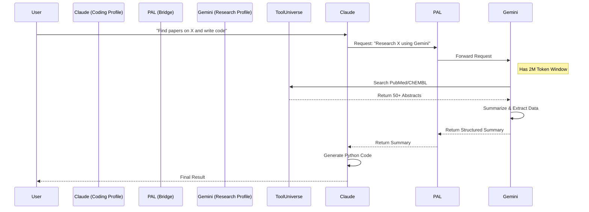

# System Architecture

## Overview

SciAgent-toolkit is a modular infrastructure that orchestrates interactions between AI Agents (Claude, Gemini, Codex) and specialized Scientific Tools via the Model Context Protocol (MCP).

## Core Components

### 1. AI Agents (The "Frontend")
- **Claude Code**: Primary interactive CLI for coding and complex reasoning.
- **Gemini CLI**: High-context agent for deep research and heavy data processing.
- **Codex CLI**: Specialized terminal interface for scientific tasks.

### 2. Role System (The "Identity Layer")
- **Script**: `activate-role.sh`
- **Definition Files**: `roles/*.yaml` (declarative role definitions)
- **Function**: Configures agent identity and available tools per project
- **Mechanism**:
  - Reads role YAML (e.g., `roles/base.yaml`)
  - Symlinks agents from `agents/` to `.claude/agents/`
  - Symlinks skills from `skills/` to `.claude/skills/`
  - Suggests appropriate MCP profile

### 3. Profile Manager (The "Controller")
- **Script**: `switch-mcp-profile.sh`
- **Function**: Dynamically configures all agents simultaneously.
- **Mechanism**:
  - Reads a "Profile Template" (e.g., `research-lite.mcp.json`).
  - Injects environment variables (API Keys, Paths) via `${VAR}` substitution.
  - Validates profile dependencies (checks for required servers/keys).
  - Generates agent-specific config files:
    - `.mcp.json` (Claude)
    - `.gemini/settings.json` (Gemini)
    - `~/.codex/config.toml` (Codex)
    - `.claude/settings.local.json` (permissions)

### 4. MCP Servers (The "Backend")
- **PAL**: The bridge between agents. Allows Claude to "call" Gemini.
- **ToolUniverse**: The scientific engine (600+ tools).
- **Serena**: The coding engine (Semantic Search).
- **Context7**: Library documentation lookup.
- **Sequential Thinking**: Cognitive utilities for structured reasoning.

### 5. Template System (The "Scaffolding")
- **Script**: `setup-ai.sh` (invokes template installation)
- **Templates**: `templates/vendor/*.template`
- **Function**: Creates consistent AI context files across projects
- **Files Created**:
  - `CLAUDE.md` - Claude Code project instructions
  - `GEMINI.md` - Gemini CLI project instructions
  - `AGENTS.md` - Universal AI rules
  - `context.md` - Scientific project context
  - `02_analysis/config/analysis_config.yaml` - Analysis parameters

## Data Flow: Hybrid Research

The "Hybrid Research" profile demonstrates the power of this architecture:



## Directory Structure

```
SciAgent-toolkit/
├── scripts/
│   ├── setup-ai.sh              # Main Entry Point (templates + roles + MCP)
│   ├── setup_mcp_infrastructure.sh  # MCP Server Installer
│   ├── switch-mcp-profile.sh    # Profile Manager (API key injection, validation)
│   ├── activate-role.sh         # Role Activator (agent/skill symlinks)
│   └── mcp_servers/             # Individual MCP setup scripts
├── roles/
│   └── base.yaml                # Default bioinformatics role
├── agents/
│   ├── bioinf-librarian.md      # Bioinformatics research agent
│   └── rnaseq-methods-writer.md # Methods section generator
├── skills/                      # Custom skills (empty by default)
├── templates/
│   ├── vendor/                  # AI context templates
│   │   ├── CLAUDE.md.template
│   │   ├── GEMINI.md.template
│   │   ├── AGENTS.md.template
│   │   ├── context.md.template
│   │   └── analysis_config.yaml.template
│   ├── mcp-profiles/            # MCP profile templates
│   │   ├── minimal.mcp.json
│   │   ├── coding.mcp.json
│   │   ├── research-lite.mcp.json
│   │   ├── research-full.mcp.json
│   │   └── full.mcp.json
│   └── gemini-profiles/         # Gemini-specific mappings
├── docker/test/                 # Docker testing infrastructure
│   ├── Dockerfile.architecture-test
│   ├── Dockerfile.tooluniverse-test
│   ├── Dockerfile.claude-test
│   ├── Dockerfile.codex-test
│   ├── Dockerfile.gemini-test
│   └── test-all.sh
└── tooluniverse-env/            # ToolUniverse Python venv (created at runtime)
```

## Integration with scbio-docker

When used as a submodule in [scbio-docker](https://github.com/tony-zhelonkin/scbio-docker):

```
scbio-docker/
├── init-project.sh              # Project scaffolding (creates 01_modules/, 02_analysis/)
├── toolkits/
│   └── SciAgent-toolkit/        # This repository (git submodule)
└── [project]/
    ├── 01_modules/              # R/Python modules (renamed from 01_scripts)
    ├── 02_analysis/
    │   └── config/
    │       └── analysis_config.yaml  # Created by setup-ai.sh
    ├── CLAUDE.md                # Created by setup-ai.sh
    ├── GEMINI.md                # Created by setup-ai.sh
    ├── AGENTS.md                # Created by setup-ai.sh
    ├── context.md               # Created by setup-ai.sh
    ├── .mcp.json                # Created by switch-mcp-profile.sh
    └── .claude/
        ├── agents/              # Symlinks from roles/ activation
        └── skills/              # Symlinks from roles/ activation
```