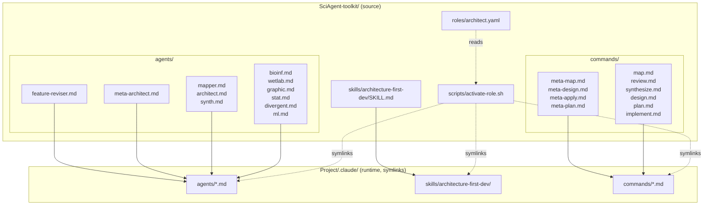
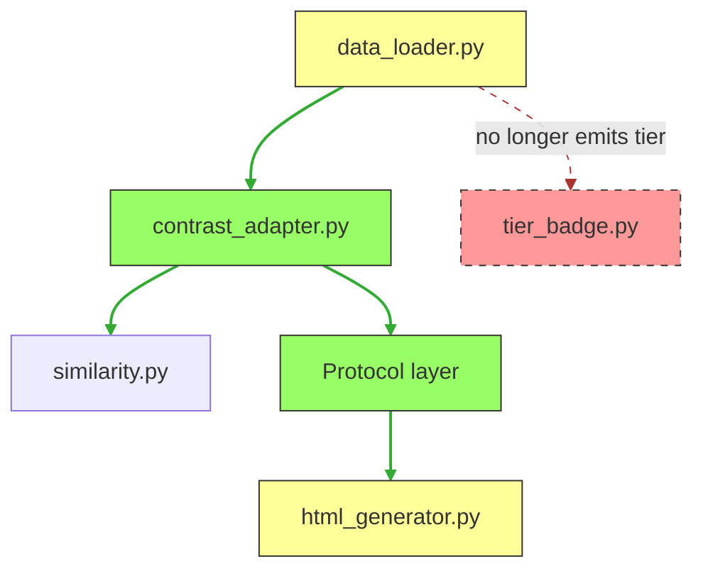

# Architecture — architect role

Structural view: what files exist, where they live, how they connect.

---

## Component map



---

## Role YAML — the manifest

`roles/architect.yaml` is the single source of truth. Three lists:

```yaml
agents:     # 11 agent files symlinked into .claude/agents/
  - bioinf          # reviewer: computational biology / bioinformatics methods
  - wetlab          # reviewer: wet-lab experimental validation & prioritisation
  - graphic         # reviewer: Tufte information graphics
  - stat            # reviewer: statistician
  - divergent       # reviewer: contrarian / saboteur
  - ml              # reviewer: ML & manifold scientist
  - mapper          # pipeline: read-only cartographer
  - architect       # pipeline: architecture review gate
  - synth           # pipeline: consensus synthesizer
  - meta-architect  # meta: cross-feature portfolio orchestrator
  - feature-reviser # parallel-propagation: applies MADR consequences to one feature's design/

skills:     # 1 skill directory symlinked into .claude/skills/
  - architecture-first-dev

commands:   # 10 command files symlinked into .claude/commands/
  - map
  - review
  - synthesize
  - design
  - plan
  - implement
  - meta-map
  - meta-design
  - meta-apply
  - meta-plan
```

Metadata fields: `name`, `description`, `mcp_profile: pal-only`.

---

## Agents catalog

### Reviewer agents (6) — invoked by `/review --as <csv>|all`

Each reviewer reads `docs/{feature}/map.md` (+ scope + design drafts) and writes exactly one file: `docs/{feature}/review/<agent>.md`.

| Agent | Lens | Model | Tools |
|-------|------|-------|-------|
| `bioinf` | Computational biology / bioinformatics methods correctness (DE, GSEA, clustering, dim-red, normalisation choices) | sonnet | Read, Grep, Glob, Write, WebSearch, WebFetch |
| `wetlab` | Bench-side utility — can I design a validation experiment from this? Tractability, prioritisation, reagent chain | sonnet | Read, Grep, Glob, Write, WebSearch, WebFetch |
| `graphic` | Edward Tufte principles: data-ink, signal/noise, perceptual encoding, affordances, information anxiety | sonnet | Read, Grep, Glob, Write |
| `stat` | Inference validity: multiple testing, power, distributional assumptions, cross-contrast stability | sonnet | Read, Grep, Glob, Write, WebSearch |
| `divergent` | Contrarian: blind spots, hidden assumptions, edge cases, motivated-reasoning flags | opus | Read, Grep, Glob, Write, WebSearch |
| `ml` | Manifolds, embeddings, distance metrics, dim-reduction choice (UMAP/t-SNE/NMF/MOFA+/FAMD) | opus | Read, Grep, Glob, Write, WebSearch, WebFetch |

`divergent` and `ml` use opus because their work is math/reasoning-heavy. The other four default to sonnet.

### Pipeline agents (4) — invoked by specific commands

| Agent | Command | Input | Output | Model |
|-------|---------|-------|--------|-------|
| `mapper` | `/map` | Feature slug + optional description | `docs/{feature}/map.md` | sonnet |
| `architect` | `/design` (post-draft gate) | `docs/{feature}/design/*.md` + `map.md` | `docs/{feature}/design/review.md` with Verdict | opus |
| `synth` | `/synthesize` | `docs/{feature}/review/*.md` | `docs/{feature}/synthesis.md` | opus |
| `status-reporter` | `/status` | Scope (`all` or slug list) + today's date | Markdown portfolio-status block (chat only; no file writes) | sonnet |

`mapper` is read-only (cartographer) — facts only, no opinions. `architect` is the consistency/completeness gate between design and plan. `synth` never reads the codebase; it only reads reviewer outputs. `status-reporter` is a leaf aggregator — frontmatter + grep only, no full file body reads, no sub-agent dispatch; dedicated sub-agent (rather than main-agent inline) to pin the model at Sonnet and keep the main context clean of the tool-result churn that portfolio grepping would otherwise generate.

### Meta agent (1) — invoked by meta-* commands

| Agent | Commands | Input | Output | Model |
|-------|----------|-------|--------|-------|
| `meta-architect` | `/meta-map`, `/meta-design`, `/meta-plan` | Per-feature artifacts in `docs/{feature}/` (across N features) + prior `docs/_meta/*` | One file per invocation: `docs/_meta/map.md`, `docs/_meta/design.md`, or `docs/_meta/plan.md` | opus |

`meta-architect` is a pure orchestrator. It reads artifacts (never the codebase) and writes only `docs/_meta/*` (never per-feature directories). It does not gate per-feature commands — the user gates instead. See [05-meta-approach.md](./05-meta-approach.md) for when and how to invoke.

### Parallel-propagation agent (1) — invoked by `/meta-apply` (N in parallel)

| Agent | Command | Input | Output | Model |
|-------|---------|-------|--------|-------|
| `feature-reviser` | `/meta-apply` (N in parallel, one per feature) | Feature slug + list of MADRs affecting it + pre-assigned deferred-ID block | Edits to `docs/{feature}/design/*.md`; row appends to `docs/_meta/deferred.md`; diff summary as final message | opus |

`feature-reviser` is scoped narrower than `architect` or `/design`'s main agent: it applies MADR consequences mechanically (edit-and-cite) rather than re-litigating architecture. Conflicts that need re-thinking are flagged as `MANUAL_REDESIGN_NEEDED` for manual `/design` follow-up — the sub-agent refuses to produce speculative revisions. Each invocation handles exactly one feature; `/meta-apply` dispatches N in parallel via a single message. Tool-set is deliberately tighter than `meta-architect` (`Edit` and `Write` are present because edits land under `docs/{feature}/design/`, but no `WebSearch`/`WebFetch` — this is not a research agent).

---

## Commands catalog

Each command file lives at `commands/<name>.md` and is a plain markdown template. When the user types `/<name>`, Claude Code injects the template as the user prompt — so the template is the dispatch logic.

| Command | Dispatches | Produces | Gates on |
|---------|------------|----------|----------|
| `/map` | `mapper` (one agent) | `docs/{feature}/map.md` | User choice if `map.md` exists (use / regenerate / append) |
| `/review` | N reviewers in parallel | `docs/{feature}/review/<name>.md` (N files) | Requires `map.md` to exist |
| `/synthesize` | `synth` (one agent) | `docs/{feature}/synthesis.md` | Requires ≥2 reviewer files |
| `/design` | Main agent writes + `architect` reviews | `design/01-architecture.md`, `02-behavior.md`, `03-decisions.md`, `review.md` | User approves draft; `architect` must emit `READY`; STOPs on MADR conflict |
| `/plan` | Main agent | `plan/README.md` (stamped `status: APPROVED`), `plan/phase-NN.md` | Requires `design/review.md` verdict = `READY`; Phase 4 is a glance-check, not a status gate |
| `/implement` | Main agent | Code + phase checklist | Default: one phase per invocation, user gate between phases. `--auto` opts into end-to-end; stops only at failure / stop-at-uncertainty / completion |
| `/meta-map` | `meta-architect` (one agent) | `docs/_meta/map.md` | Requires ≥2 features with `map.md` |
| `/meta-design` | `meta-architect` (one agent) | `docs/_meta/design.md` | Requires `_meta/map.md`; user approves at Gate 1; flips MADRs PROPOSED → ACCEPTED |
| `/meta-apply` | N `feature-reviser`s in parallel + N `architect`s in parallel | Edits across `docs/{feature}/design/*.md`; appends to `docs/_meta/deferred.md`; `docs/{feature}/design/review.md` per approved feature | Requires `_meta/design.md` APPROVED; compound Gate 1 on edits; per-feature architect Verdict = READY required for `APPROVED` status |
| `/meta-plan` | `meta-architect` (one agent) | `docs/_meta/plan.md` | Requires `_meta/design.md` status APPROVED; user approves sequencing |
| `/diagram` | Main agent (no sub-agent) | `docs/{feature}/diagrams.md` | Requires `map.md` OR `design/README.md`; read-only utility — collects Mermaid from existing artifacts |

See [02-behavior.md](./02-behavior.md) for the behavior of each stage in detail.

---

## Skill — `architecture-first-dev`

Format: canonical skill directory `skills/architecture-first-dev/SKILL.md`, auto-loaded when the role is activated.

Purpose: methodology reminder. When Claude starts the session with the role active, this skill primes the model to use the pipeline instead of jumping straight to code. It encodes:

- When to use this methodology (non-trivial features / refactors)
- When to skip it (trivial fixes, throwaway scripts)
- The 6-stage pipeline and their commands
- The token-efficiency contract (downstream reads upstream; no re-exploration)
- Human-gate discipline

The skill is short (~100 lines) by design — it's a reminder, not a tutorial.

---

## Activation script — the binding mechanism

`scripts/activate-role.sh` is the only script that touches the role system. When invoked:

```bash
scripts/activate-role.sh architect --project-dir <target>
```

it:

1. Reads `roles/architect.yaml`
2. Creates `${target}/.claude/agents/`, `skills/`, `commands/`
3. Clears existing symlinks in all three (for idempotent role switching)
4. For each `agent:` in YAML → `ln -sf toolkit/agents/<name>.md .claude/agents/<name>.md`
5. For each `skill:` → `ln -sfn toolkit/skills/<name>/ .claude/skills/<name>` (dir form) or `ln -sf` file form
6. For each `command:` → `ln -sf toolkit/commands/<name>.md .claude/commands/<name>.md`
7. Applies the role's MCP profile (via `switch-mcp-profile.sh`)
8. Runs security validation

The `commands:` handling was added to the script as part of this role — previous roles (base, pathway-signature-agent) omit a `commands:` list, and the script silently no-ops for them. Backward compatible.

---

## File layout on disk

```
SciAgent-toolkit/                              (source — edit here)
├── roles/architect.yaml
├── agents/{bioinf,wetlab,graphic,stat,divergent,ml,mapper,architect,synth,meta-architect,feature-reviser}.md
├── commands/{map,review,synthesize,design,plan,implement,meta-map,meta-design,meta-apply,meta-plan}.md
├── skills/architecture-first-dev/SKILL.md
├── scripts/activate-role.sh                   (extended for commands)
└── docs/workflows/architect/                  (this directory)
    ├── README.md
    ├── 01-architecture.md
    ├── 02-behavior.md
    ├── 03-decisions.md
    ├── 04-extending.md
    └── 05-meta-approach.md

target-project/.claude/                        (runtime — symlinks, do not edit)
├── agents/{11 symlinks}
├── commands/{10 symlinks}
└── skills/architecture-first-dev/             (symlink to dir)

target-project/docs/                           (runtime artifacts produced by the pipeline)
├── _meta/                                     (meta-layer — produced by meta-* commands)
│   ├── map.md
│   ├── design.md
│   ├── plan.md
│   └── deferred.md                            (appended by per-feature /design Phase 3b,
│                                                /meta-design Phase 6.5, and /meta-apply
│                                                sub-agents using pre-allocated ID blocks)
└── {feature}/                                 (per-feature — produced by per-feature commands)
    ├── map.md
    ├── review/*.md
    ├── synthesis.md
    ├── design/*.md
    └── plan/*.md
```

Editing a file in the toolkit immediately updates the active role — symlinks mean no re-activation needed unless the role YAML itself changes.

---

## Minimal surface area — what's deliberately not there

- **No `/scope` command** — scope is a subset of map.md's "Blast radius" section. Separate command would duplicate exploration (violates the token-efficiency contract). One artifact, one producer.
- **No architecture baseline bootstrap** — deferred. If needed, run `/map _project` once to produce `docs/_project/map.md`; feature maps can reference it as baseline.
- **No bioinformatics skills in the role** — intentionally minimal. Architecture work is decoupled from analysis work. Activate a second role (e.g., `pathway-signature-agent`) in the same project if both are needed; activation is idempotent per role.
- **No automatic progression** — every stage is human-gated. There is no "run the whole pipeline" macro. This is the feature.

---

## Worked example — `01-architecture.md § Delta view`

Every per-feature `design/01-architecture.md` must carry a `## Delta view — what changes` subsection with **one annotated Mermaid diagram** showing current-vs-proposed as a single figure (not two side-by-side). Worked example for a hypothetical `contrast-adapter` feature that adds a new adapter module and modifies `data_loader.py`:



### Legend
- Green fill / solid green edge: added by this feature (`contrast_adapter.py`, `Protocol layer`, the four new edges)
- Yellow fill: existing module, modified by this feature (`data_loader.py`, `html_generator.py`)
- Red dashed fill / red dashed edge: removed by this feature (`tier_badge.py`, the old data_loader→tier_badge edge)
- Unstyled (none in this example): existing, unchanged

Reviewers count green nodes/edges to detect over-scoping. If the green count is high and the yellow/red counts are low, the feature is largely additive — ask whether it should compose with existing modules instead. If nothing is added, modified, or removed, the feature does not need `/design`.
