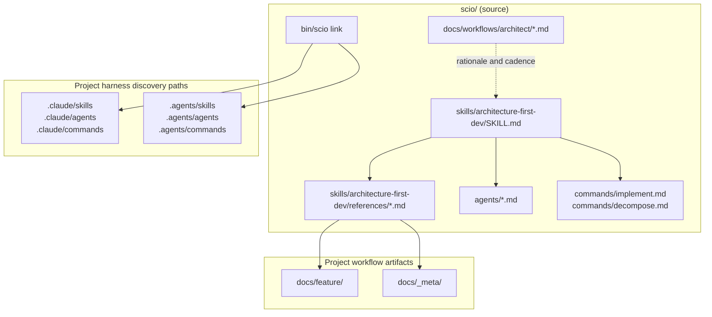
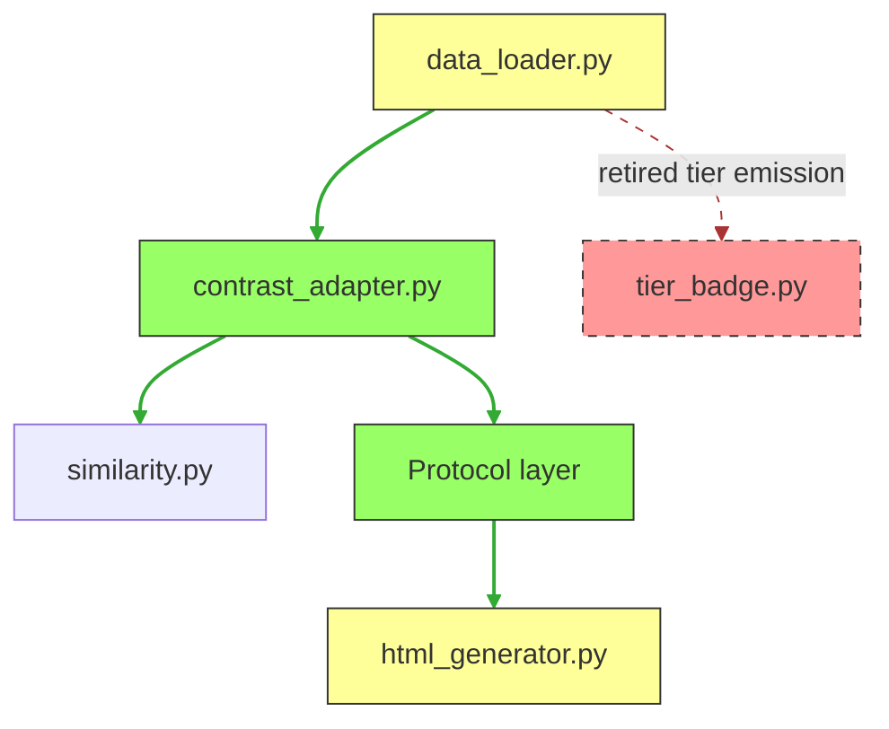

# Architecture — architecture-first workflow

Structural view: what files exist, where they live, and how the router connects
them.

---

## Component map


```mermaid
graph TD
    subgraph "scio/ (source)"
        ROUTER[skills/architecture-first-dev/SKILL.md]
        REFS[skills/architecture-first-dev/references/*.md]
        AGENTS[agents/*.md]
        COMMANDS[commands/implement.md<br/>commands/decompose.md]
        DOCS[docs/workflows/architect/*.md]
        LINK[bin/scio link]
    end

    subgraph "Project harness discovery paths"
        CLAUDE[.claude/skills<br/>.claude/agents<br/>.claude/commands]
        PORTABLE[.agents/skills<br/>.agents/agents<br/>.agents/commands]
    end

    subgraph "Project workflow artifacts"
        FEATURE[docs/feature/]
        META[docs/_meta/]
    end

    LINK --> CLAUDE
    LINK --> PORTABLE
    ROUTER --> REFS
    ROUTER --> AGENTS
    ROUTER --> COMMANDS
    DOCS -.rationale and cadence.-> ROUTER
    REFS --> FEATURE
    REFS --> META
```

`scio link` binds each complete catalog tree with one directory symlink per
harness namespace. The router and every on-demand reference therefore resolve
from the same pinned toolkit checkout.

## Router and reference contract

[`skills/architecture-first-dev/SKILL.md`](../../../skills/architecture-first-dev/SKILL.md)
is the routing spine. It owns:

- the decision tree that selects one workflow route;
- the canonical cadence;
- argument forwarding into the selected route;
- the route table from intent to a complete `references/*.md` specification;
- the boundary to the external `implement` and `decompose` commands.

Each reference owns one stage's phases, inputs, tools, artifacts, gates, and
stop conditions. The router reads a reference only after choosing that route.
This keeps normal context small while preserving the complete stage contract.

### Per-feature references

| Route | Reference | Primary result |
|---|---|---|
| `map` | `references/map.md` | `docs/{feature}/map.md` |
| `review` | `references/review.md` | `docs/{feature}/review/*.md` |
| `synthesize` | `references/synthesize.md` | `docs/{feature}/synthesis.md` |
| `design` | `references/design.md` | `docs/{feature}/design/*.md` |
| `architect` | `references/architect.md` | fresh design verdict |
| `plan` | `references/plan.md` | `docs/{feature}/plan/*.md` |
| `verify` | `references/verify.md` | `docs/{feature}/verify.md` |
| `diagram` | `references/diagram.md` | `docs/{feature}/diagrams.md` |

### Portfolio and audit references

| Route family | Reference | Scope |
|---|---|---|
| `status` | `references/status.md` | Fast feature and portfolio orientation |
| `meta-map`, `meta-design`, `meta-apply`, `meta-plan` | `references/portfolio.md` | Related features and shared decisions |
| Architecture-treemap audit routes | `references/architecture-treemap-audit.md` | Retrospective cross-cutting audit |

Implementation loads [`commands/implement.md`](../../../commands/implement.md).
Large-campaign decomposition loads
[`commands/decompose.md`](../../../commands/decompose.md). Their argument and
execution contracts remain independent of the router references.

## Agents used by the workflow

The full `agents/` catalog is mounted. The router and stage references select
the agents needed for one route.

### Reviewer agents

| Agent | Lens | Model |
|---|---|---|
| `bioinf` | Computational-biology methods | sonnet |
| `wetlab` | Experimental validation and tractability | sonnet |
| `graphic` | Information graphics and perceptual design | sonnet |
| `stat` | Statistical inference and stability | sonnet |
| `divergent` | Hidden assumptions and failure modes | opus |
| `ml` | Manifolds, embeddings, and ML choices | opus |

Reviewers consume `map.md` and write one file each under
`docs/{feature}/review/`. Round 1 is parallel-independent; iterate rounds are
cross-informed and preserve prior positions under `.history/`.

### Pipeline and portfolio agents

| Agent | Responsibility | Primary output |
|---|---|---|
| `mapper` | Codebase cartography | `map.md` |
| `synth` | Review reconciliation | `synthesis.md` |
| `architect` | Design consistency gate | `design/review.md` |
| `status-reporter` | Fast artifact-state aggregation | chat summary |
| `meta-architect` | Cross-feature decisions and sequencing | `docs/_meta/*.md` |
| `feature-reviser` | Apply accepted MADRs to one design | edits under one feature's `design/` |

Agent frontmatter supplies each sub-agent's model and tool contract. A stage
reference supplies the route-specific prompt, inputs, and output path.

## Mount and runtime layout

```text
scio/
├── agents/*.md
├── commands/*.md
├── skills/architecture-first-dev/
│   ├── SKILL.md
│   └── references/*.md
└── docs/workflows/architect/

target-project/
├── .claude/
│   ├── agents   -> <toolkit>/agents
│   ├── commands -> <toolkit>/commands
│   └── skills   -> <toolkit>/skills
├── .agents/
│   ├── agents   -> <toolkit>/agents
│   ├── commands -> <toolkit>/commands
│   └── skills   -> <toolkit>/skills
└── docs/
    ├── _meta/
    │   ├── map.md
    │   ├── design.md
    │   ├── plan.md
    │   └── deferred.md
    └── {feature}/
        ├── map.md
        ├── review/*.md
        ├── synthesis.md
        ├── design/*.md
        ├── plan/*.md
        ├── verify.md
        └── diagrams.md
```

Correct directory links need no refresh after a source edit because they expose
the pinned checkout directly. Re-run `scio link` when binding a project,
repairing a missing category link, or refreshing managed hooks and settings.

## Extension boundary

A new workflow stage consists of a complete
`skills/architecture-first-dev/references/<stage>.md` contract and a row in the
router's route table. Add an agent when the stage needs a distinct sub-agent
persona. Add an external command when the work has an execution boundary that
should remain independently invocable, as implementation and decomposition do.

See [04-extending.md](./04-extending.md) for the checklist.

## Minimal surface area

- Scope remains part of `map.md`'s blast-radius section.
- A project-level baseline can use `docs/_project/map.md` when needed.
- Scientific skills compose with this workflow through the complete mounted
  catalog.
- Human judgment gates occur at the decision points recorded in
  [03-decisions.md](./03-decisions.md).

## Worked example — `01-architecture.md § Delta view`

Every per-feature `design/01-architecture.md` carries a `## Delta view — what
changes` subsection with one annotated Mermaid diagram showing current and
proposed structure together. This example adds a contrast adapter and retires
an older badge path:


```mermaid
graph TD
  DL[data_loader.py]
  SIM[similarity.py]
  ADAPT[contrast_adapter.py]
  PROT[Protocol layer]
  HTML[html_generator.py]
  OLD[tier_badge.py]

  DL --> ADAPT
  ADAPT --> SIM
  ADAPT --> PROT
  PROT --> HTML
  DL -.->|retired tier emission| OLD

  classDef new fill:#9f6,stroke:#333;
  classDef removed fill:#f99,stroke:#333,stroke-dasharray:5 5;
  classDef touched fill:#ff9,stroke:#333;
  class ADAPT,PROT new;
  class OLD removed;
  class DL,HTML touched;
  linkStyle 0 stroke:#3a3,stroke-width:2px;
  linkStyle 1 stroke:#3a3,stroke-width:2px;
  linkStyle 2 stroke:#3a3,stroke-width:2px;
  linkStyle 3 stroke:#3a3,stroke-width:2px;
  linkStyle 4 stroke:#a33,stroke-dasharray:5 5;
```

### Legend

- Green fill and solid green edge: added by the feature.
- Yellow fill: existing module modified by the feature.
- Red dashed fill and edge: retired by the feature.
- Unstyled: existing and unchanged.

Reviewers count green nodes and edges to detect over-scoping and compare the
proposed additions with the existing surfaces being reused or changed.
