# Behavior — architect pipeline

Behavioral view: what each stage does, what artifacts flow between stages, how dispatch works.

---

## Pipeline overview

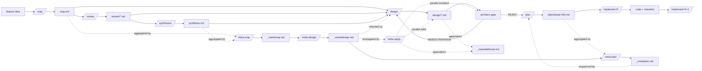

The diagonal edges in the per-feature flow show optional paths: small features go `/map` → `/design` directly; large features take the full loop.

The dashed edges show the meta-layer (optional, for ≥2 features in flight): per-feature artifacts feed `/meta-map` → `/meta-design` → `/meta-plan`, whose outputs in turn constrain per-feature `/design` and `/plan`. `/meta-apply` sits between `/meta-design` and per-feature `/design`: it propagates accepted MADRs to every in-flight `design/` in one parallel batch (dispatches N `feature-reviser` sub-agents + N `architect` gates), replacing N serial `/design` re-runs in the mechanical-propagation case. See [05-meta-approach.md](./05-meta-approach.md) for the full meta-layer cadence.

---

## Stage 1: `/map <feature>`

### Purpose
Produce the single shared artifact that every downstream stage reads. This is where codebase exploration happens — and where it stops.

### Input
- `$ARGUMENTS[0]` — feature slug OR path to an existing feature directory
- `$ARGUMENTS[1+]` — optional feature description

### Slug resolution (Phase 0.1)
- Plain slug (`umap`) → `docs/umap/`
- Relative path (`docs/umap/`) → slug = `umap`
- Absolute path (`/foo/bar/docs/umap`) → slug = `umap`, warn if outside project's `docs/`
- Resolution is always announced before dispatch

### Flow
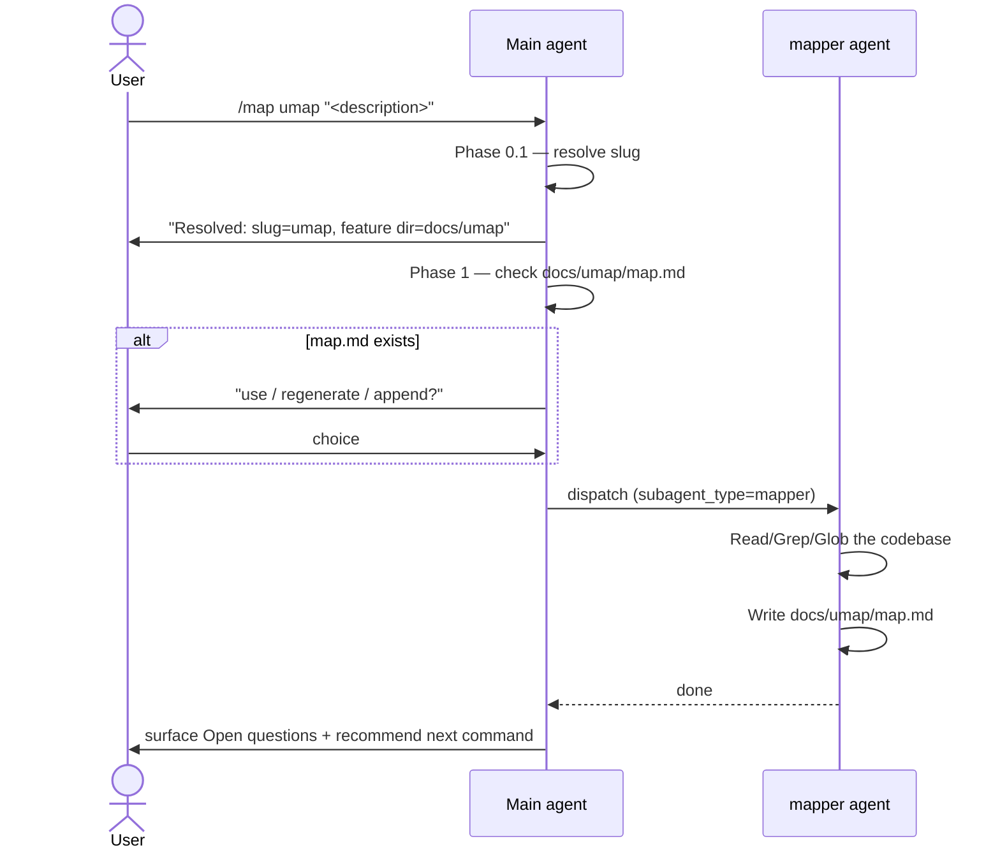

### Output
`docs/{feature}/map.md` with sections: Blast radius, Entry points & data flow, Existing patterns to reuse, Key files, Open questions.

### Error paths
- `mapper` writes outside `docs/{feature}/map.md` → flag and ask user
- Map lacks Open questions section → ask mapper to add it (every feature has irreducible uncertainty)

---

## Stage 2: `/review <feature> [--as <spec>] [--but <csv>]`

### Purpose
Apply N expert lenses to the feature in parallel. Each lens is a separate agent.

### Argument parsing
| Form | Resolves to |
|------|-------------|
| `/review f` | Interactive — ask user which reviewers |
| `/review f --as all` | `{bioinf, wetlab, graphic, stat, divergent, ml}` |
| `/review f --as all --but stat,divergent` | `all` minus listed |
| `/review f --as bioinf,ml` | Exactly those |

`--but` is only valid with `--as all`. Using it with a specific set is an error.

### Flow
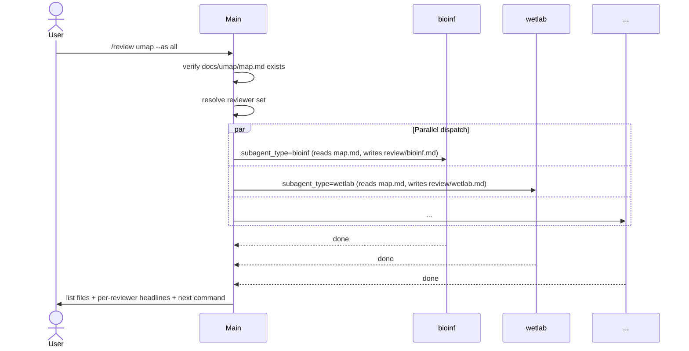

### Output
`docs/{feature}/review/<reviewer>.md` per reviewer (1–6 files).

### Critical rule
**Reviewers read the map, they do not re-explore.** This is enforced in each reviewer's system prompt. If a reviewer needs more context than map.md provides, they add an "Open questions for mapper" section — they do not grep the codebase themselves.

### Error paths
- `map.md` missing → tell user to run `/map` first, stop
- Unknown reviewer name → list valid names, stop
- `--but` without `--as all` → explain and stop

---

## Stage 3: `/synthesize <feature>`

### Purpose
Collapse multiple reviews into a consensus document. Conditional — only runs when useful.

### Flow
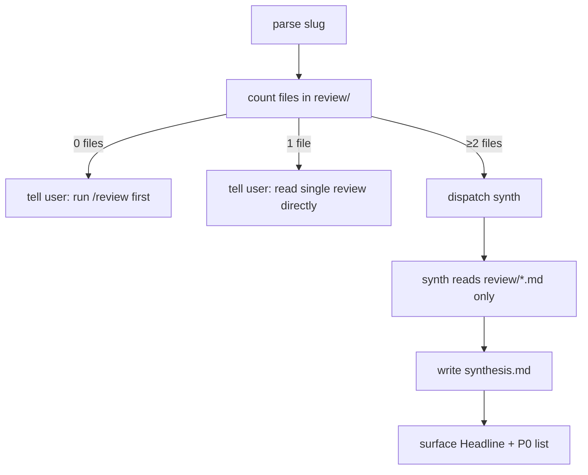

### Output
`docs/{feature}/synthesis.md` with: Headline, Convergent concerns, Divergent opinions (preserved), Open questions, Prioritized recommendations (P0/P1/P2), Reader map.

### Critical rule
**Synth preserves disagreement.** When reviewers diverged, synth names both positions faithfully — no flattening into false consensus. This protects the design from silent homogenization.

Synth never reads the codebase.

---

## Stage 3a: `/meta-map` (optional — meta-layer)

### Purpose
Aggregate per-feature `map.md` + `synthesis.md` (or `review/*.md`) across N features into a single portfolio inventory: shared touch-points, convergent concerns, inter-feature dependencies, cross-feature open questions.

### Prerequisites
≥2 features have a `map.md`.

### Flow
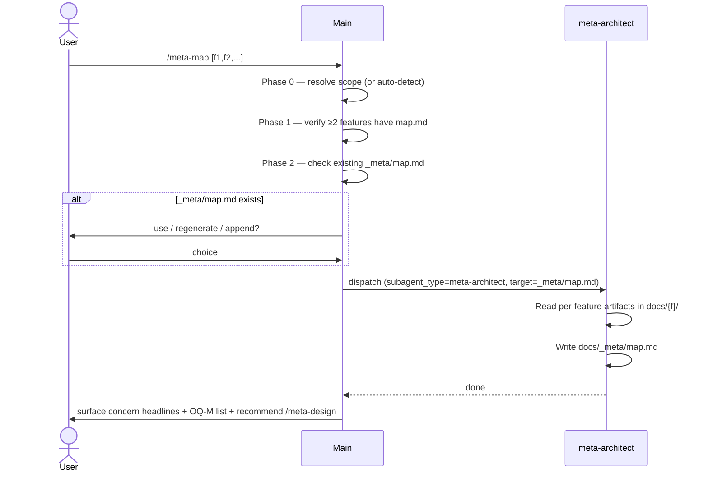

### Output
`docs/_meta/map.md` with sections: Features in scope, Shared touch-points, Convergent concerns, Inter-feature dependencies, Open cross-feature questions (`OQ-M-N`), Reader map.

### Critical rule
The agent reads only artifacts under `docs/`. If it wants to grep source, it adds an Open Question instead.

---

## Stage 3b: `/meta-design` (optional — meta-layer)

### Purpose
Translate the convergent concerns from `_meta/map.md` into MADRs (meta-ADRs) — inter-feature decisions that every per-feature `/design` will inherit.

### Prerequisites
- `docs/_meta/map.md` exists
- For each feature in scope, ideally a `synthesis.md` or `design/` exists (warn if only `map.md` is present — input will be thin)

### Flow
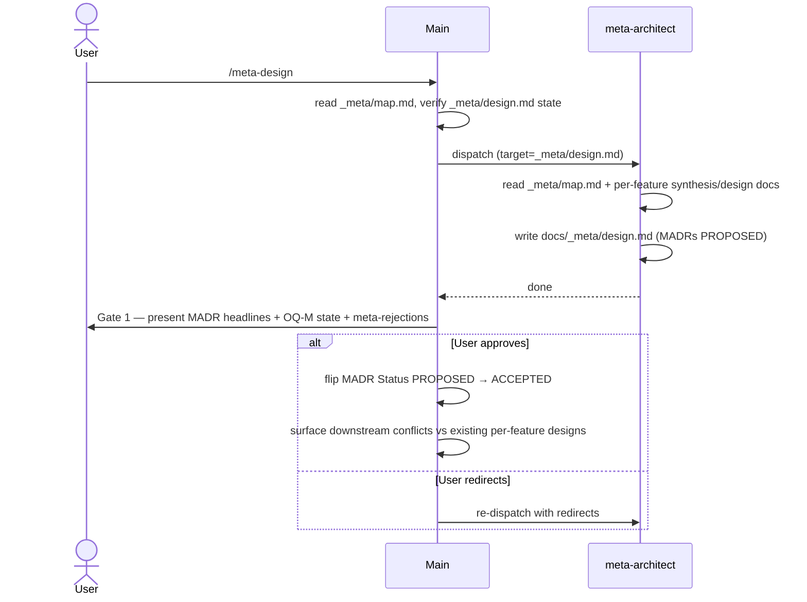

### Output
`docs/_meta/design.md` with sections: MADR-NNN entries (Context, Options, Decision, Trade-offs, Consequences per feature), Open inter-feature questions, Deliberate meta-level rejections, Reader map.

### Critical rules
1. MADRs are PROPOSED until Gate 1; only the dispatching command flips them to ACCEPTED.
2. Every convergent concern in `_meta/map.md` produces either a MADR or an entry in "Deliberate meta-level rejections" — silence on a concern is a defect.
3. Meta-design never edits per-feature design docs. It surfaces conflicts; the user re-runs `/design {feature}` to resolve.

---

## Stage 4: `/design <feature>`

### Purpose
Translate feature + map + reviews/synthesis into structural/behavioral/decision design documents. Staged drafting with a scope-approval gate before the long docs, so a misaimed scope doesn't waste 1500+ lines of ADRs.

### Flow
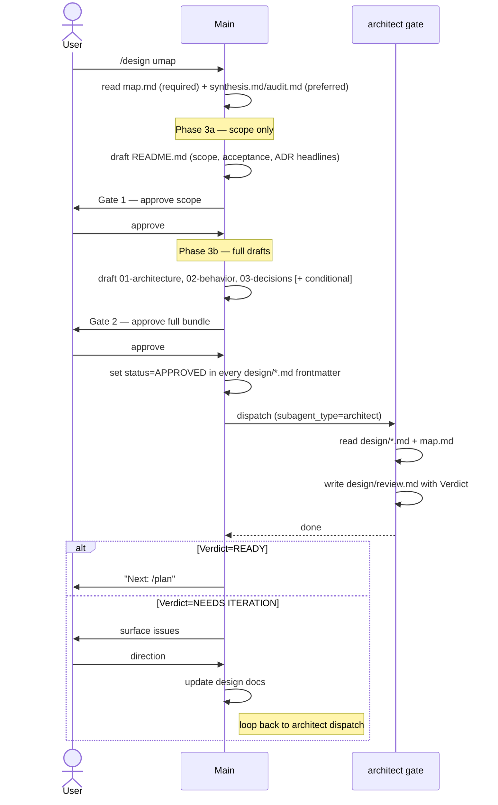

### Outputs
- `docs/{feature}/design/README.md` — index, acceptance criteria, scope, approach summary (frontmatter only — no `view:`)
- `docs/{feature}/design/01-architecture.md` — structural view (`view: structural`)
- `docs/{feature}/design/02-behavior.md` — behavioral view (`view: behavioral`, US spelling pinned)
- `docs/{feature}/design/03-decisions.md` — ADRs + Open Questions + Hard constraints + Deliberate departures (`view: decision`)
- `docs/{feature}/design/04-data-flow.md` — if pipeline with >2 stages (`view: data-flow`)
- `docs/{feature}/design/05-api-contract.md` — if endpoints exposed (`view: api-contract`)
- `docs/{feature}/design/review.md` — architect's consistency/completeness review with Verdict

### Frontmatter convention (all design docs)
Pinned in `commands/design.md` Phase 2.5. Every doc carries `feature`, `view` (from the fixed vocabulary above, US spelling), `status` (`DRAFT` | `APPROVED`), `date` (ISO). Status lives only in frontmatter — never duplicated as `**Status**:` in body.

### `03-decisions.md` substructure
Two distinct numbered lists:
- **ADRs (`ADR-NNN`)** — decisions made. Each has Status = `ACCEPTED`, explicit Decision line, Trade-offs, Risks.
- **Open Questions (`OQ-N`)** — items needing human/domain input before a decision can be written. Each has Context, Options, what blocks a decision, who should decide.

Plus: Hard constraints, and — if upstream synthesis/audit exists — a required "Deliberate departures from synthesis/audit" section naming every upstream recommendation NOT adopted, with one-sentence rationale each.

### Critical rules
1. Main agent reads map.md for file:line references, not the codebase directly
2. Large upstream artifacts use `Read(offset, limit)`, not `Bash(sed)` — the latter fragments formatting and wastes tokens
3. **Three human gates**: Phase 3a scope approval, Phase 4 full-bundle approval, architect verdict must be `READY FOR IMPLEMENTATION`
4. Loop on `NEEDS ITERATION` — update and re-dispatch architect until READY
5. An ADR with no decision is not an ADR — it's an Open Question; do not mix the two numbering schemes

---

## Stage 4a: `/design <feature>` (when meta-layer exists)

If `docs/_meta/design.md` exists, the per-feature `/design` Phase 1 reads it and inherits every MADR whose "Features affected" list contains this slug. If a local decision conflicts with a MADR, `/design` STOPS and the user must choose: re-run `/meta-design`, override locally (recorded in `03-decisions.md § Meta overrides`), or cancel.

When the per-feature `/design` Phase 3b drafts `03-decisions.md`, every time-boxed deferral in the "Deliberate departures" section is also appended to `docs/_meta/deferred.md` with full provenance (source feature, source doc, description, reason, cost, dependency, status). Permanent rejections stay in the feature doc only.

---

## Stage 4c: `/meta-apply` (optional — propagation phase)

### Purpose

Apply every accepted MADR in `_meta/design.md` to every in-flight per-feature design in one parallel batch, replacing N serial `/design` re-runs for the mechanical-propagation case. This is the team-parallel sibling of the serial `/design` fallback.

Structurally identical to `/review --as all`: a single command dispatches N narrow-scope sub-agents in parallel, collects their outputs, gates once, then fans out architect gates.

### Prerequisites

- `docs/_meta/design.md` exists with `status: APPROVED`
- ≥1 feature in scope has a `design/` directory (features without one are skipped with a recommendation to run `/design <slug>` for first-draft)

### Flow

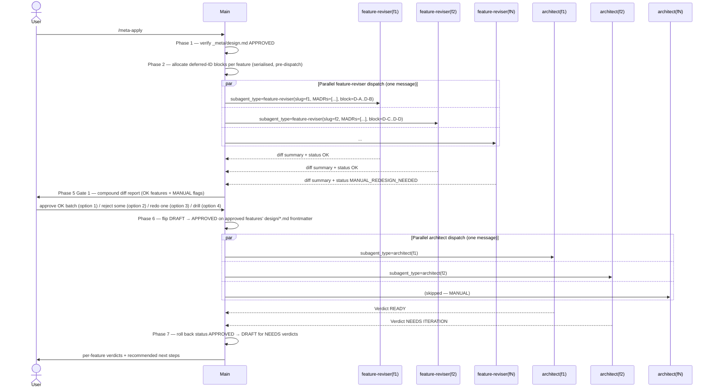

### Output

- Edits across `docs/{feature}/design/*.md` for every OK-flagged feature
- New rows in `docs/_meta/deferred.md` (one ID block per sub-agent, pre-allocated to prevent races)
- `docs/{feature}/design/review.md` per OK feature
- No edits for MANUAL-flagged features — user runs `/design <slug>` manually for each

### Critical rules

1. **Parallel dispatch in one message.** Phase 3 (feature-revisers) and Phase 6 (architects) each use a single assistant message with multiple Agent tool calls. Same pattern as `/review --as all` — see [03-decisions.md § ADR-007](./03-decisions.md).
2. **MANUAL_REDESIGN_NEEDED is a clean skip, not a failure.** It's the sub-agent saying "this feature needs user judgment beyond mechanical MADR application" — either structural re-architecting or a first-draft.
3. **Deferred-ID blocks are pre-allocated.** The main agent reads `_meta/deferred.md` watermark once in Phase 2 and hands each sub-agent an exclusive 20-ID range. Parallel writes stay race-free without coordination.
4. **Architect gate runs per feature, but in parallel.** Not serially as with `/design`. Per-feature verdicts are returned independently.
5. **Sub-agent scope is narrow.** `feature-reviser` applies MADR consequences mechanically — it does not draft new architecture, promote new ADRs (except OQ→ADR promotions directly authorised by a MADR), or re-evaluate upstream reasoning. Work that needs judgment is emitted as `MANUAL_REDESIGN_NEEDED` and falls back to `/design`.
6. **Status field handling.** Frontmatter `status:` flips `DRAFT → APPROVED` at Phase 6 (user-approved compound gate), then rolls back to `DRAFT` in Phase 7 for any feature whose architect verdict is `NEEDS ITERATION` or `NEEDS DISCUSSION`. `APPROVED` stays only on `READY` features.
7. **No self-loop on NEEDS_ITERATION.** The command surfaces the verdict; the user runs `/design <slug> --iterate` manually. Self-looping would hide architect signal behind another compound turn.

---

## Stage 4b: `/meta-plan` (optional — meta-layer)

### Purpose
Sequence per-feature `phase-NN.md` files across the portfolio so dependencies land before consumers and simultaneously active phases do not collide on the same files.

### Prerequisites
- `docs/_meta/design.md` exists with `status: APPROVED`
- At least one feature has a `plan/` directory

### Flow
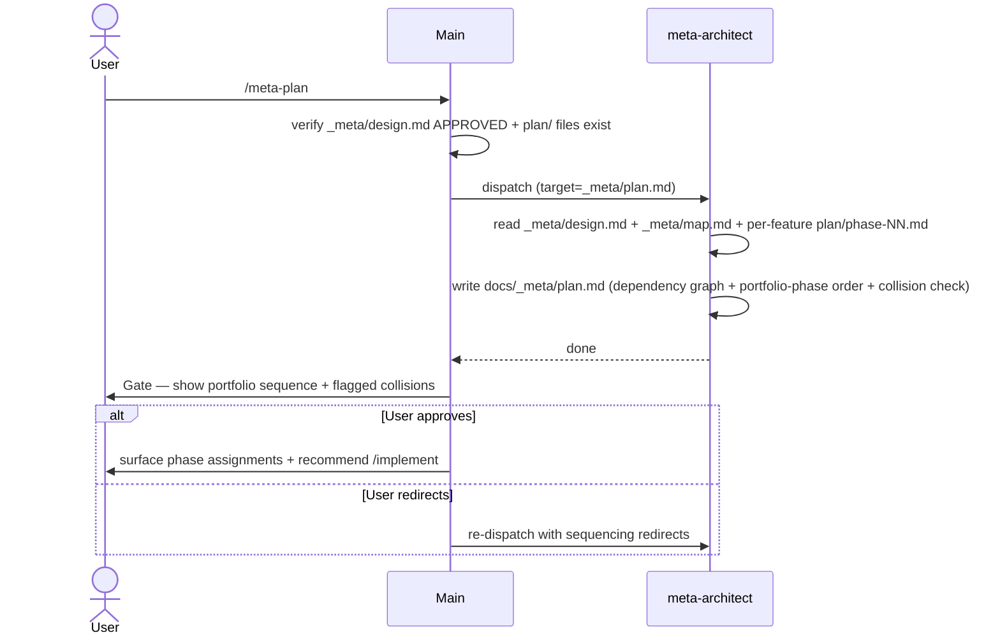

### Output
`docs/_meta/plan.md` with sections: Dependency graph (Mermaid), Portfolio-phase order, Shared-file collision check, Parking items (from `_meta/deferred.md`), Reader map.

### Critical rules
1. A flagged collision is a blocker — never silently sequenced; the user resolves.
2. Dependency edges come from `_meta/design.md` (MADR consequences) and `_meta/map.md` — not invented.
3. A feature with no `plan/` is noted, not faked.

---

## Stage 5: `/plan <feature>`

### Purpose
Decompose approved design into ordered implementation phases.

### Prerequisites
- `design/README.md` has `**Status**: APPROVED`
- `design/review.md` Verdict is `READY FOR IMPLEMENTATION`
- If `docs/_meta/plan.md` exists, the per-feature plan must honour the portfolio-phase slot assigned to this feature

### Phase ordering rule
Phases follow the canonical order: data models → core logic → storage → API → integration → error hardening. Each phase produces something testable; each touches ≤5 files.

When `_meta/plan.md` exists, decompose only within the portfolio-phase slot assigned to this feature. Do not assume primitives that the meta-plan says another feature ships first.

### Output
- `docs/{feature}/plan/README.md` — phase summary table + success criteria
- `docs/{feature}/plan/phase-NN.md` — one file per phase: Context, Files to Create, Files to Modify, Verification, References

### Critical rule
Plan is NOT design. If you find yourself re-deciding architecture while planning, stop and go back to `/design`.

---

## Stage 6: `/implement <feature> <phase>`

### Purpose
Execute exactly one phase, verify it, stop.

### Flow
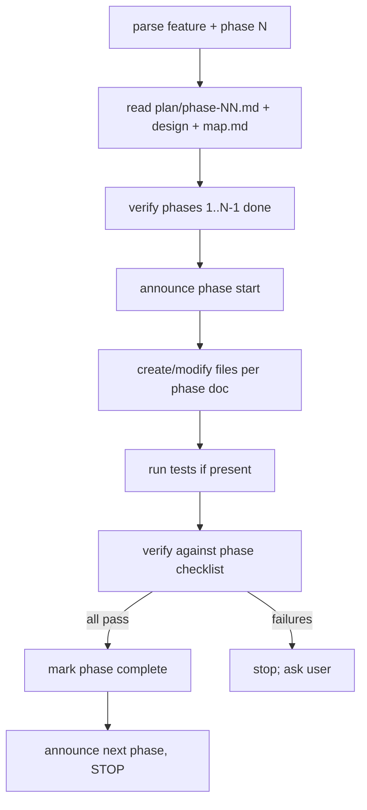

### Critical rules
1. **One phase per invocation.** No autopilot.
2. Do not re-grep for orientation — map.md is the source of truth
3. Match existing patterns from map.md (style, naming, structure)
4. No speculative error handling
5. Stop at uncertainty — ask rather than guess

---

## Data flow between stages

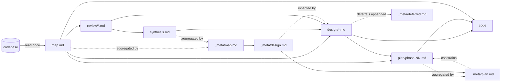

**Only mapper reads the codebase for orientation.** Every other agent reads map.md instead. This is the key data-flow invariant — see [03-decisions.md §Token-efficiency contract](./03-decisions.md) for the rationale.

**Meta-architect reads only artifacts** (per-feature `docs/{f}/*` and prior `docs/_meta/*`). It never reads the codebase. The meta-layer extends the data-flow invariant rather than violating it.
