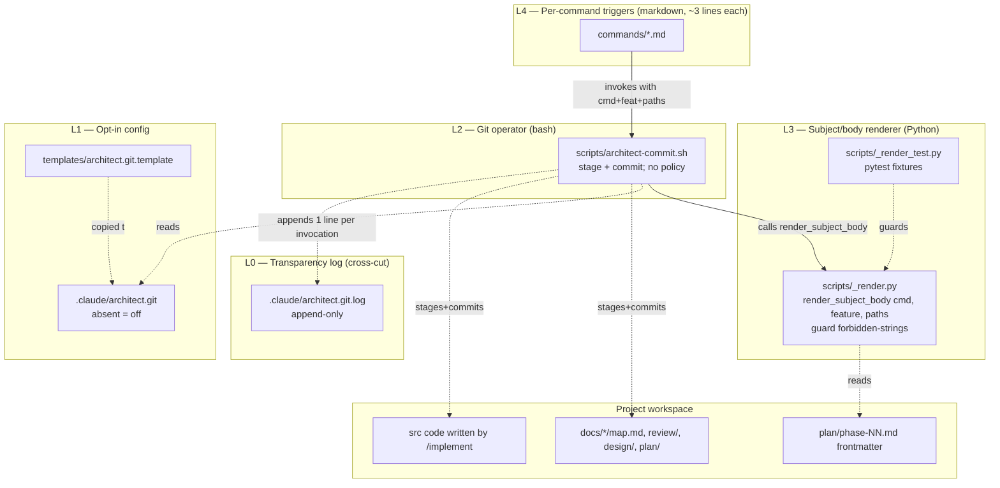

# Architecture — git automation (v2)

Structural view: the four layers + one cross-cut, where each lives, what
each touches, what each explicitly does not touch.

---

## Component map (4 layers + cross-cut)



Three things to notice in the v2 layout:

1. **L4 is thin.** Command files do not render subjects, do not compose bodies,
   do not contain bash heredocs. They invoke the helper with three flags.
2. **L3 is the policy chokepoint.** The renderer reads canonical frontmatter
   and produces (subject, body). The `guard()` filter rejects forbidden
   strings before they ever reach `git commit`. Pytest covers it.
3. **L0 is observability.** Every invocation appends one line. The user can
   audit the harness's entire git history without reading source.

---

## Components

### L0 — `.claude/architect.git.log` — transparency log

**Format:** plain text, one line per helper invocation. ISO-8601 timestamp,
pipe-delimited fields, latest at bottom (append-only). Example:

```
2026-04-29T14:33:21+00:00 | implement | umap   | committed   | a1b2c3d | feat(umap): phase 3 — similarity rewrite
2026-04-29T14:35:02+00:00 | review    | umap   | skipped     | -       | command not in COMMIT_ON
2026-04-29T14:36:14+00:00 | implement | umap   | hook-failed | -       | pre-commit: ruff format
2026-04-29T14:36:51+00:00 | implement | umap   | committed   | b2d3e4f | feat(umap): phase 4 — provenance
2026-04-29T14:40:08+00:00 | meta-apply| _meta  | switched    | -       | architect/_meta (was main)
```

**Verdict vocabulary:** `committed | skipped | hook-failed | refused | switched | dry-run`.

**Why append-only:** the user reads it with `tail`/`grep`; rotation invites
parsing. If it grows unbearable, the user truncates it manually. The
harness never touches the file except to append.

**Git status:** path lives under `.claude/`, which the toolkit's
`.gitignore` already excludes. The log is local-only; not history,
not pushed.

**Responsibilities:**
- Owns: capture every helper invocation outcome.
- Does not own: human-readable summaries, log rotation, parsing tools.

### L1 — `.claude/architect.git` — opt-in config

**Format:** `KEY=value` lines, `#` comments, bash-sourceable.

**Template** (`templates/architect.git.template`, copied into
`.claude/architect.git` only via `activate-role.sh --with-git`):

```bash
# Architect git automation — local config
# Delete this file to disable auto-commit entirely.

ARCHITECT_GIT_AUTOCOMMIT=true

# Which commands may auto-commit. Comma-separated. Default: all.
ARCHITECT_GIT_COMMIT_ON=map,review,synthesize,design,architect,plan,implement,verify,meta-map,meta-design,meta-apply,meta-plan

# Create a feature branch (prefix + slug) on first commit for that
# feature. Leave false for single-branch workflows.
ARCHITECT_GIT_BRANCHES=false
ARCHITECT_GIT_BRANCH_PREFIX=architect/

# Safety rails — script ignores any other value.
ARCHITECT_GIT_ATTRIBUTION=false
ARCHITECT_GIT_AUTOPUSH=false
```

**Removed in v2:** `ARCHITECT_GIT_META_BRANCH`. Meta-layer always commits
on current branch. (See ADR-015 in `03-decisions.md`.)

**Responsibilities:**
- Owns: master switch, command allow-list, branch policy.
- Does not own: commit-message templates, per-command behavior, anything else.

### L2 — `scripts/architect-commit.sh` — the git operator

**Responsibility:** stage the explicit path list, call the renderer for
subject + body, run `git commit`, append one log line. No policy
decisions — every "should I commit?" question is answered by L1 config
or by the path list being empty.

**Inputs (CLI contract):**

```
architect-commit.sh \
  --command=<map|review|synthesize|design|architect|plan|implement|verify|meta-map|meta-design|meta-apply|meta-plan> \
  --feature=<slug>                 # or _meta for meta-layer commands
  --paths=<p1,p2,…>                # explicit list; mandatory
  [--phase=<N>]                    # /implement only
  [--dry-run]                      # print what would happen, don't touch git
  [--verbose]                      # extra trace to stderr
  [--selftest]                     # run smoke checks and exit
```

**Behaviour (in order):**

1. Read `.claude/architect.git`. Absent or `AUTOCOMMIT=false` → log
   `skipped | disabled` and exit 0.
2. Refuse to run outside a git worktree (exit 3, log `refused | not-in-worktree`).
3. Refuse if `--paths` is empty or missing (exit 2, log `refused | no-paths`).
4. If `ARCHITECT_GIT_BRANCHES=true` and the current branch ≠
   `${PREFIX}{feature}`, create-and-switch on **first** commit for that
   feature; subsequent commits stay on that branch. **Branch switch
   emits a visible chat line and logs `switched | <newbranch> (was <oldbranch>)`**
   (hidden-state mitigation).
5. Validate every path is inside the repo root (exit 4 on traversal).
   `git add -- <paths>`. **Never** `git add .` or `-A`.
6. If `git diff --cached --quiet` (nothing to commit), log
   `skipped | empty` and exit 0. (Single source of truth for skip.)
7. Call `python3 scripts/_render.py --command=<X> --feature=<Y>
   --paths=<list>` to obtain `subject\n\nbody`. The renderer's `guard()`
   filter has already rejected any forbidden string; if the renderer
   exits non-zero, the helper exits 5 with the renderer's stderr.
8. `git commit -F -` with the rendered message. **Never** `--no-verify`,
   `--amend`, `--no-gpg-sign`, or `-f`. On hook failure → exit 5, log
   `hook-failed | <hook-name-if-known>`.
9. On success: log `committed | <short-sha> | <subject>`. Print one
   chat line: `architect-commit: ✓ <subject> (<sha>) on <branch>`.

**Exit codes:**

| Code | Meaning | Log verdict |
|------|---------|------|
| 0    | Commit made, or intentionally skipped | `committed` / `skipped` / `dry-run` |
| 2    | Bad input (missing flag, unknown command) | `refused` |
| 3    | Not in a git worktree | `refused` |
| 4    | Path outside repo root, or `git restore` would clobber dirty edits | `refused` |
| 5    | `git commit` itself failed (hook, signing, branch conflict) | `hook-failed` |

**What the script does not do:**

- Does not push, pull, fetch, merge, rebase, tag, stash.
- Does not write to `~/.gitconfig`, `.git/config`, or `.gitignore`.
- Does not parse diffs, render messages, or know command-specific
  templates. All of that is L3's job.
- Does not prompt interactively.

### L3 — `scripts/_render.py` — subject/body renderer + `guard()` filter

**Responsibility:** given (command, feature, paths), produce a
deterministic (subject, body) tuple by reading authoritative frontmatter
in the project (`plan/phase-NN.md` is canonical post-Tier-1; design and
plan READMEs supply additional fields). Apply `guard()` to both subject
and body before returning.

**Module shape:**

```python
# scripts/_render.py
def render_subject_body(command: str, feature: str, paths: list[str],
                         phase: int | None = None) -> tuple[str, str]:
    fn = COMMAND_HANDLERS[command]
    subject, body = fn(feature=feature, paths=paths, phase=phase)
    return guard(subject), guard(body)

COMMAND_HANDLERS = {
    "map": _render_map,
    "review": _render_review,
    "synthesize": _render_synthesize,
    "design": _render_design,
    "architect": _render_architect,
    "plan": _render_plan,
    "implement": _render_implement,
    "verify": _render_verify,
    "meta-map": _render_meta_map,
    "meta-design": _render_meta_design,
    "meta-apply": _render_meta_apply,
    "meta-plan": _render_meta_plan,
}

FORBIDDEN_PATTERNS = [
    r"Co-Authored-By:\s*(Claude|Gemini|Codex|GPT|OpenAI|Anthropic|Google)",
    r"Generated with (Claude|Gemini|Codex|OpenAI)",
    r"🤖", r"Claude Code", r"Anthropic", r"<noreply@(anthropic|google|openai)\.com>",
    # ...
]

def guard(text: str) -> str:
    """Raise ValueError if any forbidden pattern matches; otherwise return as-is."""
```

Each `_render_<command>` function reads the relevant frontmatter (e.g.,
for `implement`: `docs/{feature}/plan/phase-{N}.md` for `phase`,
`focus`, `verification`, `notes`) and returns canonical strings. No
heuristics — every rendered field maps to a frontmatter field that
`/implement` already wrote per the canonical schema.

**Invocation contract from L2:**

```bash
python3 scripts/_render.py --command=implement --feature=umap \
                            --phase=3 \
                            --paths=pathway_explorer/similarity.py,tests/test_similarity.py
# stdout: 2 lines (subject) + (blank) + (body lines)
# exit 0 on success; non-zero with stderr explaining on guard rejection or missing frontmatter
```

**Why a CLI wrapper instead of a Python import in the bash script:**
keeps L2 in pure bash (no `python3` runtime requirement bleed into the
git operator's primary path), and keeps the renderer testable as a
process boundary.

**Tests:** `scripts/_render_test.py` — pytest covering:

- 13 commands × happy-path: render against fixture `docs/` tree;
  assert subject and body shape.
- Forbidden-string rejection: 7 attempted-injection cases (one per
  pattern); assert each raises `ValueError`.
- Frontmatter-missing graceful failure: each command's renderer returns
  a generic-but-valid subject when optional fields are absent.

**What the renderer does not do:**
- Does not run git commands.
- Does not write files.
- Does not know about branches, hooks, or commit modes.
- Does not query the user.

### L4 — Per-command triggers in `commands/*.md`

Each artifact-producing command file gains a ≤3-line terminal phase:

```markdown
## Phase N: Commit (if enabled)

Invoke `scripts/architect-commit.sh --command=<this-command-name> \
--feature={slug} --paths=<comma-separated paths just written>`. The
helper composes the message via `scripts/_render.py` and no-ops if
`.claude/architect.git` is absent.
```

**Required substitutions per command:** `<this-command-name>` (literal
string), `{slug}` (already in scope), `<paths>` (the command's path
list — see `01-architecture.md § Paths touched, by command`).

**No** subject template. **No** body heredoc. **No** "do NOT append
authorship" reminder (the renderer's `guard()` is the enforcement).

`/status` carries a one-line note instead: `This command does not
commit.`

---

## What already exists and is reused

| Existing | Purpose | What we use it for |
|----------|---------|---------------------|
| `.claude/settings.local.json` with `Shell(git:*)` | Permission to run any git subcommand | Permits the helper script without new grants |
| `/meta-apply` Phase 5 option 2: `git restore docs/{slug}/design/*.md` | Rollback on rejection | Wrapped in v2 by a dirty-path safety check (see ADR-016) |
| `phase-NN.md` canonical frontmatter | Schema written by `/implement` | The renderer reads it for subject/body fields |
| `activate-role.sh` symlink installer | Role/agent/skill activation | Gains `--with-git` flag (copies template to `.claude/`) |

No existing agent, MCP server, or skill is modified.

---

## Paths touched, by command

The helper stages only the paths listed below. All relative to the git
root. Unchanged from v1 except `/design` and `/meta-apply`.

| Command | Paths staged |
|---------|-------------|
| `/map {feat}` | `docs/{feat}/map.md` |
| `/review {feat} --as <set>` | `docs/{feat}/review/*.md` (files written this invocation) |
| `/synthesize {feat}` | `docs/{feat}/synthesis.md` |
| `/design {feat}` | `docs/{feat}/design/*.md` (single commit at Gate 2; v1 split removed — see ADR-006-superseded-by-ADR-014) |
| `/architect {feat}` | `docs/{feat}/design/review.md` + any `design/*.md` whose status was flipped |
| `/plan {feat}` | `docs/{feat}/plan/README.md`, `docs/{feat}/plan/phase-*.md` |
| `/implement {feat} {N}` | All Files-to-Create + Files-to-Modify from `docs/{feat}/plan/phase-N.md` + the phase doc itself |
| `/verify {feat}` | `docs/{feat}/verify.md` |
| `/meta-map` | `docs/_meta/map.md` |
| `/meta-design` | `docs/_meta/design.md`, `docs/_meta/deferred.md` (if appended) |
| `/meta-apply` | **One atomic commit:** every approved feature's `docs/{feat}/design/*.md` + the relevant slice of `docs/_meta/deferred.md`. (v1 per-feature loop removed — see ADR-006-superseded-by-ADR-014) |
| `/meta-plan` | `docs/_meta/plan.md` |
| `/status` | **No commit.** Chat-only output. |

---

## Invariants

1. **The helper script is the only place that runs `git`.** Command files
   never shell out to git directly; agents never run `git add`/`commit`.
2. **The renderer is the only place that composes commit-message text.**
   Command files never construct subjects or bodies; the helper passes
   raw context to L3.
3. **Attribution is off, always.** Two independent enforcement points:
   `guard()` in the renderer and the helper's no-trailer message
   composition. `ARCHITECT_GIT_ATTRIBUTION` exists in config for
   discoverability only.
4. **Commit happens after the gate.** Rejection means the working tree
   is reverted (never a post-factum `git revert`).
5. **Paths staged ⊆ paths the command just wrote.** No "while we're here"
   staging.
6. **No --no-verify, ever.** Pre-commit hook failures surface to the
   user; the harness does not bypass them.
7. **No empty commits.** If nothing was staged, exit 0 with `skipped | empty`.
8. **Every helper invocation is logged.** L0 captures committed,
   skipped, refused, hook-failed, and switched outcomes. The user can
   audit without reading source.
9. **Branch switches are visible.** When `ARCHITECT_GIT_BRANCHES=true`
   moves the user to `architect/{slug}`, the helper emits a chat line
   AND logs the switch. No silent moves.
10. **Dirty paths are safe.** Before any rejection-rollback (`git
    restore`) the helper runs `git status --porcelain` against the
    target paths. If any have uncommitted hand-edits the user might
    lose, exit 4 and require a stash. (See ADR-016.)
